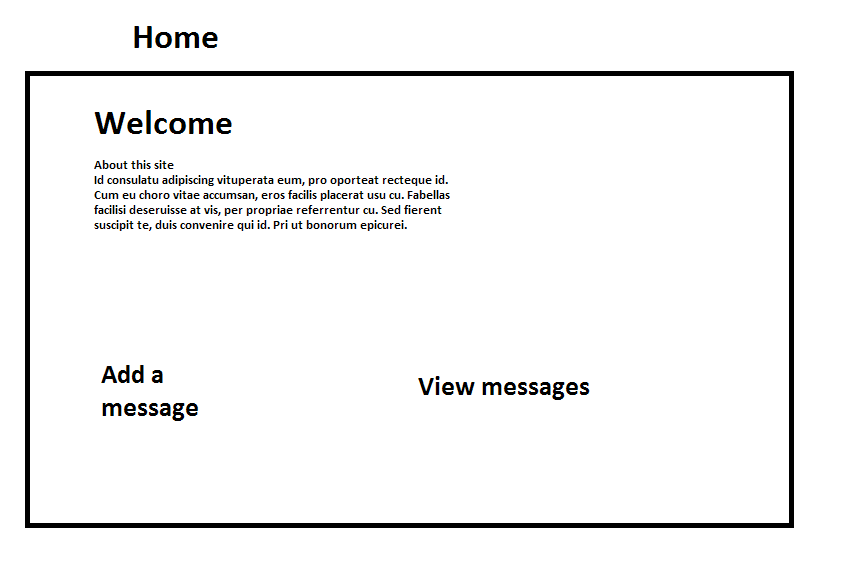
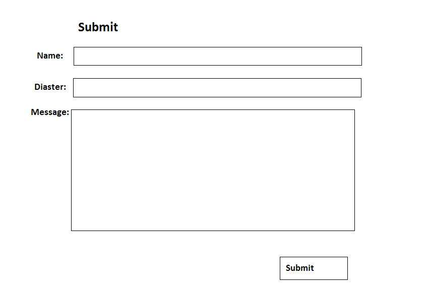

# YourLovedOne.net

## Overview
Have you ever lost track of a loved one in an emergency? Have you ever wondered where you can safely and reliably post a message in an event of a diaster? Perhaps to tell a loved one that you are safe, or to point out important information locally around you. Posting on sites like Facebook and Twitter may not reach everyone, and sites like that have commerical interests which sometimes isn't the best for someone in a diaster.

YourLovedOne.net is a webapp that will allow users to post their own messages on the site, with the context of diaster in mind. It is the one place that you could always trust in posting information in an event of diaster.

# User Story
As a victim of a diaster, I want to post a message somewhere public and stable so that my loved ones know I'm safe.
As a worried friend/family, I want to know that my loved one is safe.
As someone who has been affected with a diaster, I want to share my information with others around me.
As someone who has been affected with a diaster, I want to get more information so I'm more informed of what is happening around me.
As a concerned citizen, I want to know what is going on in a particular diaster.

# Wireframes

# Site Map

# Data Model
Diaster - will contain: title, any number of posts
Person - will contain: name, any number of posts
Post - will contain: message, datePosted

# Routes
GET /home
GET /sumbit
POST /submit
GET /view
POST ajax /view

# Research Topics
(1 Point) To use the Debug library. It allows me to print out debug messages easily without hard coding any console.log statements.
DEBUG=app nodemon bin/www

(1 Point) To use Bootstrap. It will give a unified theme to my website. Although for a simple site like YourLovedOne.net it would not be too much of a difference it would still make the site more professional looking.

(2 Points) (Configuration) To use nconf to configure my project. nconf can store everything as json which is really easy to use. I have used nconf to dynamically supply the address to my database.

(2 Points) To use gulp/eslint that automates a code quality check. Update package-json to add a command to automate this.
gulpfile.js, package.json (npm run-script lint)

(1 Point) (Client side Library) To enable markdown style syntax in input. I used a library called "marked". This also includes a 'sanitized' default option which ignores potentially dangerous html content.
Enter some markdown and it should show up in messages.

7(hopefully) points in total.

# Deployment
As my project is already on digitalocean, I used screen -rD and ran nodemon bin/www on port 80. Also, MongoDB is bind to localhost.

# Future development
On a serious note, facebook's function is probably much more useful than my site. Nonetheless, we have to bear in mind that it is the niches of the market that most opportunities lie in. A simple, robust site with a easy domain and a simple idea can get viral. An example out of the top of my head could be omegle.com - something that graduates of this class could probably make in a week. 